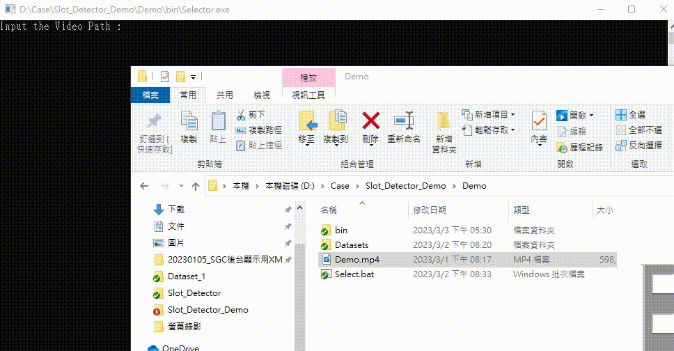

# 自動辨識牌面程式使用範本 

---
## 專案介紹

&emsp;&emsp;使用自動辨識拉霸機偵測程式可以快速而有效的判斷出拉霸機的牌面，省去手動判斷的時間，避免人為錯誤。可以應用在博弈產業、遊戲機台等方面，大幅提高作業效率與正確性。該程式能夠即時識別出拉霸機中的各種圖案及其排列，往後可以進一步透過數據分析，提供更多有用的資訊，如 RTP、CV 值等等，讓使用者更容易分析遊戲機台的設定機率。此方案專門設計為適用於各種不同型號的拉霸機，進一步提高其實用性，以下為偵測的效果畫面 :  

  

### --> 下載並使用，點擊此處的 [範例](https://gitlab.uj.com.tw/ray1105/slot_detector_demo/-/archive/main/slot_detector_demo-main.zip?path=Demo) 檔案。

---
## 檔案總覽  
此處會講解每個檔案的作用以及每個檔案的用途，並且在後面的 [使用說明](#使用說明) 中詳細說明如何操作與使用。

- 以下樹狀圖為範例檔案的資料夾結構

``` Terminal
Demo
│   demo.mp4                                                  (範例影片)
│   Select.bat                                                (框選器 執行檔)
│
├───bin [程式檔案]
│   │   Detector.exe
│   │   Selector.exe
│   │   *.dll
│   │
│   └───tessdata [文字辨識模型資料夾]
|           *OCR文字辨識模型檔案
│
└───Datasets [生成數據及資料夾]
    |
    └───Dataset_XXX [生成數據集]
        │   Detect.bat                                        (偵測執行檔)
        │   save_selected_image.png                           (框選完的瀏覽圖片)
        │   settings.json                                     (偵測程式設定參數，使用之前需修改參數)
        │
        ├───Labels [標籤資料夾]
        │       *Labels.png                                   (所有偵測標籤圖片)
        │
        ├───Output [辨識資料輸出檔案]
        │   │   Convert-(Time)-Demo.csv     (模板轉換 輸出檔案)
        │   │   Convert.bat                                   (模板轉換 執行檔)
        │   │   Template.csv                                  (輸出 CSV 模板)
        │   │
        │   └───Date [分類資料夾]
        |       (Time) Demo.csv                               (根據時間分類的輸出 CSV 檔案)
        │
        └───Videos [影片資料夾]
                Demo.mp4                                      (demo 影片)
```

- demo.mp4：此為範例影片檔案，供使用者參考。可以透過此影片了解程式運作方式。  
  
- Select.bat：框選器的執行檔，可以手動選擇影片中要辨識的區域，讓程式只處理指定框選的範圍(由此執行)。
- bin目錄：程式檔案所在資料夾，包含以下檔案和資料夾：
  - Detector.exe：偵測程式的程式檔，可用來對選擇的區域進行牌面偵測，並再結束時匯出CSV檔案。
  - Selector.exe：框選器的程式檔，可用來手動選擇影片中要辨識的區域。
  - *.dll：程式運行所需的動態連結庫檔案。
  - tessdata目錄：文字辨識模型資料夾，包含OCR文字辨識模型檔案。
### 以下檔案為執行 "Select.bat" 之後自動產生
- Datasets目錄：生成數據及資料夾所在資料夾，包含以下檔案和資料夾：  

  - Dataset_XXX目錄：根據影片生成的數據集，XXX 為自動編號 1 ~ N 。
  - Detect.bat：偵測程式的執行檔 (由此執行)。
  - save_selected_image.png：框選完的瀏覽圖片。
  - settings.json：偵測程式設定參數 *(使用之前需修改參數)*。  
- Labels目錄：標籤檔案所在資料夾，包含以下檔案：
  - *Labels.png：所有偵測標籤圖片 *(需要加入標籤圖片)*。
- Output目錄：辨識資料輸出檔案所在資料夾，包含以下檔案和資料夾：  

  - Template.csv：想要輸出的 CSV 模板樣式。
  - Convert-(Time)-Demo.csv : 模板轉換所輸出的檔案。
  - Convert.bat : 模板轉換的執行檔案。
  - Date目錄 ( YYYY-MM-DD )：根據日期分類的資料夾。  
    - Time ( hh-mm-ss ) Demo.csv：根據時間分類的輸出 CSV 檔案。
- Videos目錄：影片檔案所在資料夾，包含以下檔案：  

  - Demo.mp4：demo 影片，框選完後會考被一分到此資料夾，也可放入其他想偵測的影片進去。

---
## 使用說明
### Select.bat
1. 雙擊 `Select.bat` 檔案。
2. 雙擊後會跳出輸入視窗，將你想要辨識的影片拖曳至其中，可以設定第二個參數(播放延遲多少毫秒，用來較準確的選擇你要框選哪一禎的畫面，預設值為延遲100毫秒，不輸入第二個值的時候會以延遲100毫秒執行此程式)。  
   例如 : `Input the Video Path : demo.mp4(你的路徑) 100(延遲時間 毫秒)` ，輸入完成後按 `Enter` 鍵開始框選程式。  
   
     

3. 此時會進入延遲100毫秒的選擇畫面介面，程式標題欄會顯示提示字樣 `Pressed "Enter" to choise whitch frame you want to select`，此時 : 
   - 按住 `Esc` 鍵 : 退出程式 (不執行任何動作)。
   - 按下 `Enter` 鍵 : 選定你要的畫面。
4. 當選擇完畫面 (按下 `Enter` 鍵之後)，標題欄會顯示提示字樣 `Pressed any key to continue, or pressed "R" to RE-SELECT frame`，出現此提示時代表你已經選定想要的畫面，此時 : 
   - 按住 `Esc` 鍵 : 直接退出不執行任何動作。
   - 按下 `R` 鍵 : 重新選擇想要的畫面。
   - 按下其他按鍵 : 繼續接下來的程式。
   
    

5. 選擇完你想框選的畫面後便會進入框選主程式，並點擊滑鼠左鍵框選你想要辨識的區域 (框選順序必須按照條輪帶表的順序框選，不可以跳著選)，此時 : 
   - 按住 `Esc` 鍵 : 退出程式 (不執行任何動作)。
   - 點擊 <font color=#green>`左`</font> 鍵滑鼠 : 框選想要的範圍。
   - 按下 `+` 鍵 : 增加框選框的線條粗度。
   - 按下 `-` 鍵 : 減少框選框的線條粗度。 
   - 按下 <font color=yellow>`M`</font> 鍵 : 框選金錢的範圍 (只能框選一組金錢，且一定要框選)。
   - 按下 <font color=#FF00FF>`P`</font> 鍵 : 框選特殊模式 (MODE) 的區域，用來檢測是否進入特別的模式 (只能框選一組特殊模式，且一定要框選)。
   - 按下 `Enter` 鍵 : 選定此次框選範圍。
   - 按下 `S` 鍵 : 儲存結果並結束框選程式。
   
    

6. 按下 `S` 之後將會在 `Demo` 資料夾下生成 `Datasets` 資料夾 (如果已經存在則不會生成，沒有此資料夾才會生成)，以及 `Dataset_XXX` 的子資料夾，打開生成的 `Dataset_XXX` 資料夾，這便是此程式幫你生成的設定檔案，下面會在 [Detect.bat](#detectbat) 的地方說明如何設定與使用此程式，並成功讓它運行起來。
   
     

---
### Detect.bat
&emsp;&emsp;要成功運行 `Detect.bat` 需要將比對圖片放入 `Labels` 資料夾中，這些照片是要用來與剛剛框選的區域進行特徵比對，如果相似就會判斷為這一張照片，詳細算法可以參考 [ORB](https://docs.opencv.org/3.4/d1/d89/tutorial_py_orb.html) 算法，此方法為目前開源方案 (免費項目) 中效果較佳且速度較快的方案，且不需要使用到大量 GPU 運算，詳細設定步驟如下 :  

1. 打開 `Labels` 資料夾，將擷取好的特徵圖片放入此資料夾中 (可以參考 `Dataset_1/Labels` 資料夾) ，以下有幾點放入偵測圖片需要特別注意的地方 :
   - 圖片解析度不能太低 (可以將影片先開啟放大到全螢幕在擷取圖片，效果會較準確)。
   - 特徵圖片不需要太多背景，盡量比要偵測的圖片範圍小，只留圖片的邊緣輪廓即可。
   - 將圖片命名為最後輸出想要的名稱 (標籤名子為什麼，最後輸出就會叫什麼)。
   - 特殊模式請在你取的名子前面加上 `MODE_` 字樣，如 `MODE_FreeSpin` ，這樣程式就會判斷成 MODE 模式，後面想要取什麼名子都可以。
   - 如果有判斷不出來的影像，可以單獨擷取那張並命名如 : `MODE_XXX_FREE` (MODE模式命名法)，其他如果有便是不出來的可以命名為 `你要取的名子_XXX`，輸出時程式會將底線後面省略，保留第一個字樣 (MODE 模式則會保留最後一個)。
   
     

2. 設定 `settings.json` 檔案，有以下幾個參數 (前兩項為需要調整項，其他可以不動) : 
   - `add_label_seq` : (必須設定) 每條輪帶表有幾個，如範例中輪帶表有五條，假如每一條輪帶有三個則可以將其表示為 : `"add_label_seq" : [3,3,3,3,3]`，以此類推，注意此選項必須與全部相加總和相同。  
   
   - `add_save_addition` : 如設定 1 每條輪代表會多一個判斷，而設定 2 每條輪代表則會多兩個判斷 (預設為2)。  
   - `continue_detect_frame` : 連續幾禎圖片將其視為有效偵測禎。
   - `Continue mode frame` : 連續幾禎圖片將其視為有效模式禎。
   - `Continue money frame` : 連續幾禎圖片將其視為有效金錢禎。
   - `delay_frame` : 影片延遲 (毫秒)，不可以設為 0 會卡住不動。
   - `detect_video` : 所要偵測的影片。
   - `detector_threshold` : 偵測敏感度(閥值)。
   - `mode_labels_box` : 模式偵測框。
   - `money_labels_box` : 金錢偵測框。
   - `select_labels_box` : 主要偵測框。  
  
3. 當以上都設定完成後，雙擊 `Detect.bat` 檔案，便可以開始辨識，偵測完成的輸出資料會儲存在 `Datasets/Dataset_XXX/Output/` 資料夾中，可以在到裡面查看詳細資料 : 
   
     

   以上資料皆為一行一行的儲存格式，如果想要輸出成你想要的樣式，則可以參考以下部分 [TransformCSV.bat](#transformcsvbat) 的說明文檔。
   
---
### TransformCSV.bat
&emsp;&emsp;輸出時所儲存的資料如下圖所示，由於儲存的時候並不知道使用者所想儲存的格式，所以都是以每組一個 row 的方式儲存，但是考量到計畫的辛苦以及不容易去展示結果，所以這邊我讓程式自動升成一個初始模板，透過修改這個初始模板的樣式來改成自己想要的樣式。  

  

以下將分別說明使用 `Convert.bat` 的詳細步驟 : 

1. 進入 `Datasets/Dataset_XXX/Output` 資料夾，開啟 `Template.csv` 檔案，開啟後將其修改為你想要的樣式，儲存並關閉。  

2. 修改完後雙擊 `Convert.bat` 檔案，會跳出一個對話框，將你想要轉換的檔案拖曳至對話框中並且按下 `Enter` 鍵執行，看到 " finished! " 字樣代表修改成功。
3. 回到 `Datasets/Dataset_XXX/Output` 資料夾，可以看到新增了一個開頭為 `Convert-` 的檔案，此檔案為最終的輸出檔案，實際遭作如下 : 
   
     

   

---
## 注意事項
1. 在錄影時，如果有訊息欄或是對話框 (任何可能會影響判斷結果的東西)，請把它關掉以免干擾判斷。
2. 框選的時後，標記的範圍盡量比原圖範圍大一點，超出去沒關係，不需要框選剛剛好。
3. 判別的 `Labels` 圖片解析度要高，擷取的照片盡量小於要判斷的照片，可以把多餘不是特徵的背景裁去掉。